# データベースER図

- File Version: v1.3.3
- Project Version: v1.3.25
- Last Updated: 2025-06-22

[readmeへ](../../README.md) | [設計ポリシーへ](policy.md) | [構造定義へ](structure.md)

## 凡例
- `||--o{` : 1対多の関連（1つのエンティティが複数のエンティティを持つ）
- `}o--||` : 多対1の関連（複数のエンティティが1つのエンティティに属する）
- `}o--o|` : 多対0または1の関連（複数のエンティティが0または1つのエンティティに属する）
- `||--||` : 1対1の関連（1つのエンティティが1つのエンティティに属する）
- `}o--o{` : 多対多の関連（複数のエンティティが複数のエンティティに属する）

<!--
erDiagram template
Table{
   field_name field_type key(PK or FK or PK/FK or "" )
}
-->

```mermaid
erDiagram
%% ===========================
%% Master Tables
%% ===========================
CLASS_TABLE {
    class_id int PK
    class_name text
    created_at timestamp
}
SUBCLASS_TABLE {
    subclass_id int PK
    subclass_name text
    created_at timestamp
}
FACULTY {
    faculty_id int PK
    faculty_name text
    created_at timestamp
}
SUBJECT_NAME {
    subject_name_id int PK
    name text
    created_at timestamp
}
INSTRUCTOR {
    instructor_id int PK
    name text
    name_kana text
    created_at timestamp
}
SYLLABUS_MASTER {
    syllabus_id int PK
    syllabus_code text
    syllabus_year int
    created_at timestamp
    updated_at timestamp
}
BOOK {
    book_id int PK
    title text
    author text
    publisher text
    price int
    isbn text
    created_at timestamp
}
BOOK_UNCATEGORIZED {
    id int PK
    syllabus_id int FK
    title text
    author text
    publisher text
    price int
    role text
    isbn text
    categorization_status text
    created_at timestamp
    updated_at timestamp
}
SUBJECT_ATTRIBUTE {
    attribute_id int PK
    attribute_name text
    description text
    created_at timestamp
}

%% ===========================
%% Transaction Tables
%% ===========================
SYLLABUS {
    syllabus_id int PK,FK
    subject_name_id int FK
    subtitle text
    term text
    campus text
    credits int
    goals text
    summary text
    attainment text
    methods text
    outside_study text
    textbook_comment text
    reference_comment text
    advice text
    created_at timestamp
    updated_at timestamp
}
SUBJECT_GRADE {
    id int PK
    syllabus_id int FK
    grade text
    created_at timestamp
    updated_at timestamp
}
LECTURE_TIME {
    id int PK
    syllabus_id int FK
    day_of_week text
    period int
    created_at timestamp
    updated_at timestamp
}
LECTURE_SESSION {
    lecture_session_id int PK
    syllabus_id int FK
    session_number int
    contents text
    other_info text
    created_at timestamp
    updated_at timestamp
}
LECTURE_SESSION_IRREGULAR {
    lecture_session_irregular_id int PK
    syllabus_id int FK
    session_pattern text
    contents text
    other_info text
    created_at timestamp
    updated_at timestamp
}
SYLLABUS_INSTRUCTOR {
    id int PK
    syllabus_id int FK
    instructor_id int FK
    role text
    created_at timestamp
    updated_at timestamp
}
LECTURE_SESSION_INSTRUCTOR {
    id int PK
    lecture_session_id int FK
    instructor_id int FK
    role text
    created_at timestamp
    updated_at timestamp
}
LECTURE_SESSION_IRREGULAR_INSTRUCTOR {
    id int PK
    lecture_session_irregular_id int FK
    instructor_id int FK
    role text
    created_at timestamp
    updated_at timestamp
}
SYLLABUS_BOOK {
    id int PK
    syllabus_id int FK
    book_id int FK
    role text
    note text
    created_at timestamp
}
GRADING_CRITERION {
    id int PK
    syllabus_id int FK
    criteria_type text
    ratio int
    note text
    created_at timestamp
}

%% ===========================
%% Basic Table
%% ===========================
SUBJECT {
    subject_id int PK
    subject_name_id int FK
    faculty_id int FK
    curriculum_year int
    class_id int FK
    subclass_id int FK
    requirement_type text
    created_at timestamp
    updated_at timestamp
}

%% ===========================
%% Relation Tables
%% ===========================
SUBJECT_SYLLABUS {
    id int PK
    subject_id int FK
    syllabus_id int FK
    created_at timestamp
    updated_at timestamp
}
SUBJECT_ATTRIBUTE_VALUE {
    id int PK
    subject_id int FK
    attribute_id int FK
    value text
    created_at timestamp
    updated_at timestamp
}
SYLLABUS_STUDY_SYSTEM {
    id int PK
    source_syllabus_id int FK
    target text
    created_at timestamp
    updated_at timestamp
}

%% ===========================
%% Relationships
%% ===========================
SUBJECT_NAME ||--o{ SUBJECT : subject_name_id
FACULTY ||--o{ SUBJECT : faculty_id
CLASS_TABLE ||--o{ SUBJECT : class_id
SUBCLASS_TABLE }o--o| SUBJECT : subclass_id

SUBJECT_NAME ||--o{ SYLLABUS : subject_name_id
INSTRUCTOR ||--o{ SYLLABUS_INSTRUCTOR : instructor_id
INSTRUCTOR ||--o{ LECTURE_SESSION_INSTRUCTOR : instructor_id
INSTRUCTOR ||--o{ LECTURE_SESSION_IRREGULAR_INSTRUCTOR : instructor_id
BOOK ||--o{ SYLLABUS_BOOK : book_id
SUBJECT_ATTRIBUTE ||--o{ SUBJECT_ATTRIBUTE_VALUE : attribute_id
SYLLABUS_MASTER ||--o{ BOOK_UNCATEGORIZED : syllabus_id

SUBJECT ||--o{ SUBJECT_SYLLABUS : subject_id
SUBJECT ||--o{ SUBJECT_ATTRIBUTE_VALUE : subject_id

SYLLABUS_MASTER ||--|| SYLLABUS : syllabus_id
SYLLABUS_MASTER ||--o{ SUBJECT_GRADE : syllabus_id
SYLLABUS_MASTER ||--o{ LECTURE_TIME : syllabus_id
SYLLABUS_MASTER ||--o{ LECTURE_SESSION : syllabus_id
SYLLABUS_MASTER ||--o{ LECTURE_SESSION_IRREGULAR : syllabus_id
SYLLABUS_MASTER ||--o{ SYLLABUS_INSTRUCTOR : syllabus_id
SYLLABUS_MASTER ||--o{ SYLLABUS_BOOK : syllabus_id
SYLLABUS_MASTER ||--o{ GRADING_CRITERION : syllabus_id
SYLLABUS_MASTER ||--o{ SYLLABUS_STUDY_SYSTEM : source_syllabus_id
SYLLABUS_MASTER ||--o{ SUBJECT_SYLLABUS : syllabus_id
LECTURE_SESSION ||--o{ LECTURE_SESSION_INSTRUCTOR : lecture_session_id
LECTURE_SESSION_IRREGULAR ||--o{ LECTURE_SESSION_IRREGULAR_INSTRUCTOR : lecture_session_irregular_id
```

[目次へ戻る](#目次) 