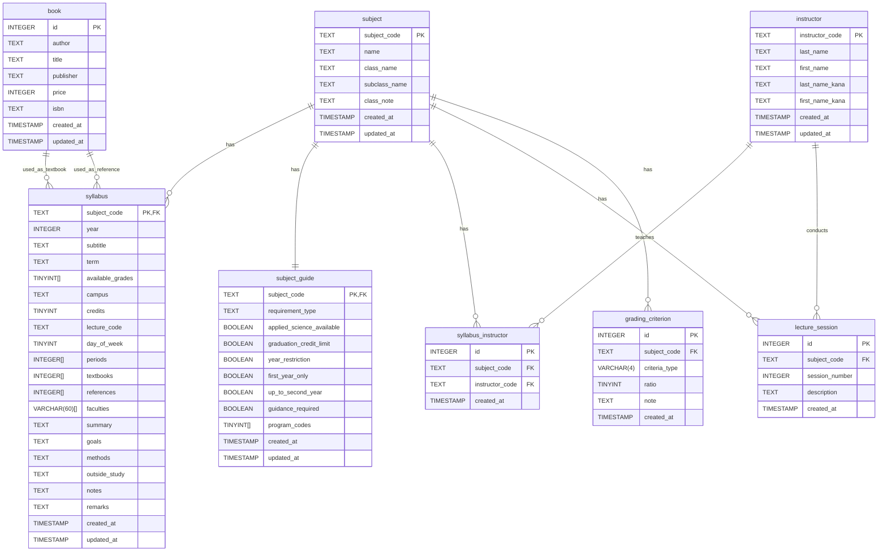

# データベースER図

[readmeへ](../../README.md) | [構造定義へ](structure.md) | [設計ポリシーへ](policy.md)

## 目次

### 現行テーブル
1. [subject（科目基本情報）](#subject科目基本情報)
2. [syllabus（シラバス情報）](#syllabusシラバス情報)
3. [instructor（教員）](#instructor教員)
4. [syllabus_instructor（シラバス-教員関連）](#syllabus_instructorシラバス-教員関連)
5. [lecture_session（講義計画）](#lecture_session講義計画)
6. [book（書籍）](#book書籍)
7. [grading_criterion（成績評価基準）](#grading_criterion成績評価基準)
8. [subject_guide（科目履修ガイド）](#subject_guide科目履修ガイド)

### 廃止テーブル
1. [syllabus_time（講義時間）](#syllabus_time講義時間)
2. [syllabus_textbook（シラバス-教科書関連）](#syllabus_textbookシラバス-教科書関連)
3. [syllabus_reference（シラバス-参考文献関連）](#syllabus_referenceシラバス-参考文献関連)
4. [syllabus_faculty（シラバス-学部/課程関連）](#syllabus_facultyシラバス-学部課程関連)
5. [subject_requirement（科目要件・属性）](#subject_requirement科目要件属性)
6. [subject_program（科目-学習プログラム関連）](#subject_program科目-学習プログラム関連)

## 更新履歴

| 日付 | バージョン | 更新者 | 内容 |
|------|------------|--------|------|
| 2024-03-20 | 1.0.0 | 藤原 | 初版作成 |

## ER図

## テーブル間の関連

### 現行テーブル

#### subject（科目基本情報）
- 1対多の関係で`syllabus`テーブルと関連
- 1対1の関係で`subject_guide`テーブルと関連

#### syllabus（シラバス情報）
- 多対1の関係で`subject`テーブルと関連
- 多対多の関係で`instructor`テーブルと関連（`syllabus_instructor`テーブルを介して）
- 1対多の関係で`lecture_session`テーブルと関連
- 多対多の関係で`book`テーブルと関連（配列カラム`textbooks`で管理）
- 多対多の関係で`book`テーブルと関連（配列カラム`references`で管理）
- 1対多の関係で`grading_criterion`テーブルと関連

#### instructor（教員）
- 多対多の関係で`syllabus`テーブルと関連（`syllabus_instructor`テーブルを介して）
- 1対多の関係で`lecture_session`テーブルと関連

#### syllabus_instructor（シラバス-教員関連）
- 多対1の関係で`syllabus`テーブルと関連
- 多対1の関係で`instructor`テーブルと関連

#### lecture_session（講義計画）
- 多対1の関係で`syllabus`テーブルと関連
- 多対1の関係で`instructor`テーブルと関連

#### book（書籍）
- 多対多の関係で`syllabus`テーブルと関連（配列カラム`textbooks`で管理）
- 多対多の関係で`syllabus`テーブルと関連（配列カラム`references`で管理）

#### grading_criterion（成績評価基準）
- 多対1の関係で`syllabus`テーブルと関連

#### subject_guide（科目履修ガイド）
- 1対1の関係で`subject`テーブルと関連

### 廃止テーブル

#### syllabus_time（講義時間）
※ このテーブルは削除され、syllabusテーブルのperiodsカラムに統合されました。

#### syllabus_textbook（シラバス-教科書関連）
※ このテーブルは削除され、syllabusテーブルのtextbooksカラムに統合されました。

#### syllabus_reference（シラバス-参考文献関連）
※ このテーブルは削除され、syllabusテーブルのreferencesカラムに統合されました。

#### syllabus_faculty（シラバス-学部/課程関連）
※ このテーブルは削除され、syllabusテーブルのfacultiesカラムに統合されました。

#### subject_requirement（科目要件・属性）
※ このテーブルは削除され、subject_guideテーブルに統合されました。

#### subject_program（科目-学習プログラム関連）
※ このテーブルは削除され、subject_guideテーブルのprogram_codesカラムに統合されました。

[目次へ戻る](#目次) 