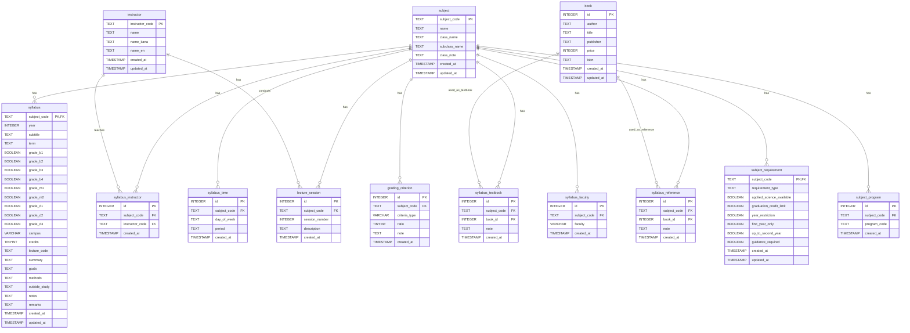

# シラバスデータベース ER図仕様

[readmeへ](../../README.md) | [構造定義へ](structure.md) | [設計ポリシーへ](policy.md)

## 目次
1. [概要](#概要)
2. [ER図](#er図)
3. [エンティティ一覧](#エンティティ一覧)
4. [リレーション一覧](#リレーション一覧)
5. [制約一覧](#制約一覧)

## 更新履歴

| 日付 | バージョン | 更新者 | 内容 |
|------|------------|--------|------|
| 2024-03-20 | 1.0.0 | 藤原 | 初版作成 |

## 関連ドキュメント
- [データベース構造定義](structure.md)
- [データベース設計ポリシー](policy.md)
- [データベースライブラリ仕様](python.md)
- [データモデル定義](../python/models.md)

[🔝 ページトップへ](#データベース-er図) 