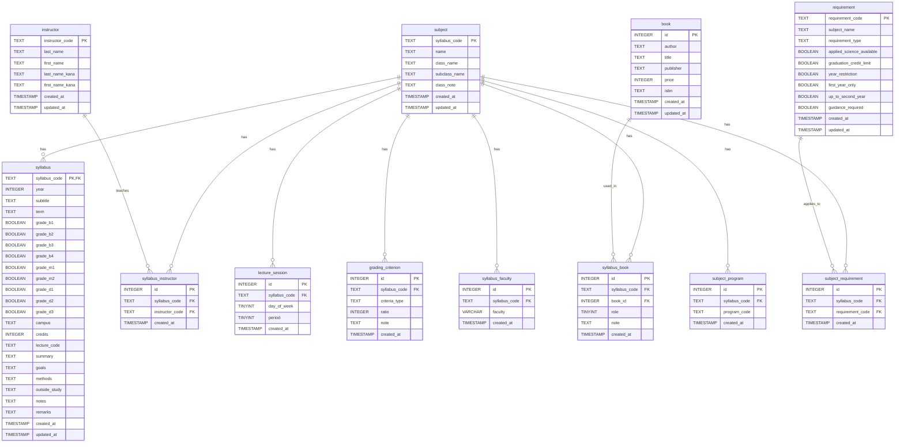

# データベースER図

[readmeへ](../../README.md) | [設計ポリシーへ](policy.md) | [構造定義へ](structure.md)

## 目次

### テーブル構成
1. [subject（科目基本情報）](#subject科目基本情報)
2. [syllabus（シラバス情報）](#syllabusシラバス情報)
3. [lecture_session（講義時間）](#lecture_session講義時間)
4. [instructor（教員）](#instructor教員)
5. [syllabus_instructor（シラバス-教員関連）](#syllabus_instructorシラバス-教員関連)
6. [book（書籍）](#book書籍)
7. [syllabus_book（シラバス-教科書関連）](#syllabus_bookシラバス-教科書関連)
8. [grading_criterion（成績評価基準）](#grading_criterion成績評価基準)
9. [syllabus_faculty（シラバス-学部/課程関連）](#syllabus_facultyシラバス-学部課程関連)
10. [requirement（科目要件・属性）](#requirement科目要件属性)
11. [subject_requirement（科目-要綱関連）](#subject_requirement科目-要綱関連)
12. [subject_program（科目-学習プログラム関連）](#subject_program科目-学習プログラム関連)

## 更新履歴

| 日付 | バージョン | 更新者 | 内容 |
|------|------------|--------|------|
| 2025-05-19 | 1.0.0 | 藤原 | 初版作成 |
| 2025-05-20 | 1.1.0 | 藤原 | テーブル名・カラム名の統一（subject_code → syllabus_code） |
| 2025-05-20 | 1.1.1 | 藤原 | requirementテーブルの主キーをrequirement_codeに修正 |
| 2025-05-20 | 1.1.2 | 藤原 | インデックス名の統一、外部キー制約の整理 |

## ER図

## テーブル間の関連

### 1対多の関連
- subject → syllabus
- subject → lecture_session
- subject → syllabus_instructor
- subject → syllabus_book
- subject → grading_criterion
- subject → syllabus_faculty
- subject → subject_requirement
- subject → subject_program
- instructor → syllabus_instructor
- book → syllabus_book
- requirement → subject_requirement

### 多対多の関連
- subject ⟷ instructor (syllabus_instructor)
- subject ⟷ book (syllabus_book)
- subject ⟷ requirement (subject_requirement)

## 主キーと外部キー

### 主キー
- subject: syllabus_code
- syllabus: syllabus_code
- lecture_session: id
- instructor: instructor_code
- syllabus_instructor: id
- book: id
- syllabus_book: id
- grading_criterion: id
- syllabus_faculty: id
- requirement: requirement_code
- subject_requirement: id
- subject_program: id

### 外部キー
- syllabus.syllabus_code → subject.syllabus_code
- lecture_session.syllabus_code → syllabus.syllabus_code
- syllabus_instructor.syllabus_code → subject.syllabus_code
- syllabus_instructor.instructor_code → instructor.instructor_code
- syllabus_book.syllabus_code → subject.syllabus_code
- syllabus_book.book_id → book.id
- grading_criterion.syllabus_code → syllabus.syllabus_code
- syllabus_faculty.syllabus_code → subject.syllabus_code
- subject_requirement.syllabus_code → subject.syllabus_code
- subject_requirement.requirement_code → requirement.requirement_code
- subject_program.syllabus_code → subject.syllabus_code

[目次へ戻る](#目次) 