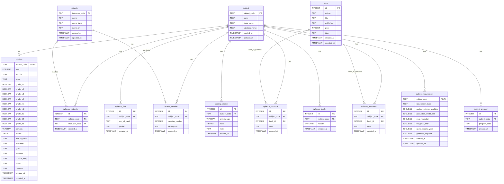

# シラバスデータベース ER図仕様

[readmeへ](../README.md) | [DB構造へ](database_structure.md) | [PostgreSQL設定へ](postgresql.md) | [ライブラリ仕様へ](database_python.md)

## 目次
1. [概要](#概要)
2. [ER図](#er図)
3. [エンティティ一覧](#エンティティ一覧)
4. [リレーション一覧](#リレーション一覧)
5. [制約一覧](#制約一覧)

```mermaid
erDiagram
    subject ||--o{ syllabus : "has"
    subject ||--o{ syllabus_time : "has"
    subject ||--o{ syllabus_instructor : "has"
    subject ||--o{ lecture_session : "has"
    subject ||--o{ syllabus_textbook : "has"
    subject ||--o{ syllabus_reference : "has"
    subject ||--o{ grading_criterion : "has"
    subject ||--o{ syllabus_faculty : "has"
    subject ||--o{ subject_requirement : "has"
    subject ||--o{ subject_program : "has"
    
    instructor ||--o{ syllabus_instructor : "teaches"
    instructor ||--o{ lecture_session : "conducts"
    
    book ||--o{ syllabus_textbook : "used_as_textbook"
    book ||--o{ syllabus_reference : "used_as_reference"

    subject {
        TEXT subject_code PK
        TEXT name
        TEXT class_name
        TEXT subclass_name
        TIMESTAMP created_at
        TIMESTAMP updated_at
    }

    syllabus {
        TEXT subject_code PK, FK
        INTEGER year
        TEXT subtitle
        TEXT term
        BOOLEAN grade_b1
        BOOLEAN grade_b2
        BOOLEAN grade_b3
        BOOLEAN grade_b4
        BOOLEAN grade_m1
        BOOLEAN grade_m2
        BOOLEAN grade_d1
        BOOLEAN grade_d2
        BOOLEAN grade_d3
        VARCHAR campus
        TINYINT credits
        TEXT lecture_code
        TEXT summary
        TEXT goals
        TEXT methods
        TEXT outside_study
        TEXT notes
        TEXT remarks
        TIMESTAMP created_at
        TIMESTAMP updated_at
    }

    instructor {
        TEXT instructor_code PK
        TEXT name
        TEXT name_kana
        TEXT name_en
        TIMESTAMP created_at
        TIMESTAMP updated_at
    }

    book {
        INTEGER id PK
        TEXT author
        TEXT title
        TEXT publisher
        INTEGER price
        TEXT isbn
        TIMESTAMP created_at
        TIMESTAMP updated_at
    }

    syllabus_instructor {
        INTEGER id PK
        TEXT subject_code FK
        TEXT instructor_code FK
        TIMESTAMP created_at
    }

    syllabus_time {
        INTEGER id PK
        TEXT subject_code FK
        TEXT day_of_week
        TEXT period
        TIMESTAMP created_at
    }

    lecture_session {
        INTEGER id PK
        TEXT subject_code FK
        INTEGER session_number
        TEXT description
        TIMESTAMP created_at
    }

    syllabus_textbook {
        INTEGER id PK
        TEXT subject_code FK
        INTEGER book_id FK
        TEXT note
        TIMESTAMP created_at
    }

    syllabus_reference {
        INTEGER id PK
        TEXT subject_code FK
        INTEGER book_id FK
        TEXT note
        TIMESTAMP created_at
    }

    grading_criterion {
        INTEGER id PK
        TEXT subject_code FK
        VARCHAR criteria_type
        TINYINT ratio
        TEXT note
        TIMESTAMP created_at
    }

    syllabus_faculty {
        INTEGER id PK
        TEXT subject_code FK
        VARCHAR faculty
        TIMESTAMP created_at
    }

    subject_requirement {
        TEXT subject_code PK, FK
        TEXT requirement_type
        BOOLEAN applied_science_available
        BOOLEAN graduation_credit_limit
        BOOLEAN year_restriction
        BOOLEAN first_year_only
        BOOLEAN up_to_second_year
        BOOLEAN guidance_required
        TIMESTAMP created_at
        TIMESTAMP updated_at
    }

    subject_program {
        INTEGER id PK
        TEXT subject_code FK
        TEXT program_code
        TIMESTAMP created_at
    }
``` 

## 更新履歴

| 日付 | バージョン | 更新者 | 内容 |
|------|------------|--------|------|
| 2024-03-20 | 1.0.0 | 藤原 | 初版作成 |

[🔝 ページトップへ](#シラバスデータベース-er図仕様) 