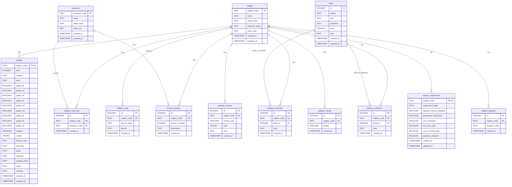

# シラバスデータベース ER図仕様

[readmeへ](../README.md) | [DB構造へ](database_structure.md) | [PostgreSQL設定へ](postgresql.md) | [ライブラリ仕様へ](database_python.md)

## 目次
1. [概要](#概要)
2. [ER図](#er図)
3. [エンティティ一覧](#エンティティ一覧)
4. [リレーション一覧](#リレーション一覧)
5. [制約一覧](#制約一覧)

## 更新履歴

| 日付 | バージョン | 更新者 | 内容 |
|------|------------|--------|------|
| 2024-03-20 | 1.0.0 | 藤原 | 初版作成 |

[🔝 ページトップへ](#シラバスデータベース-er図仕様) 